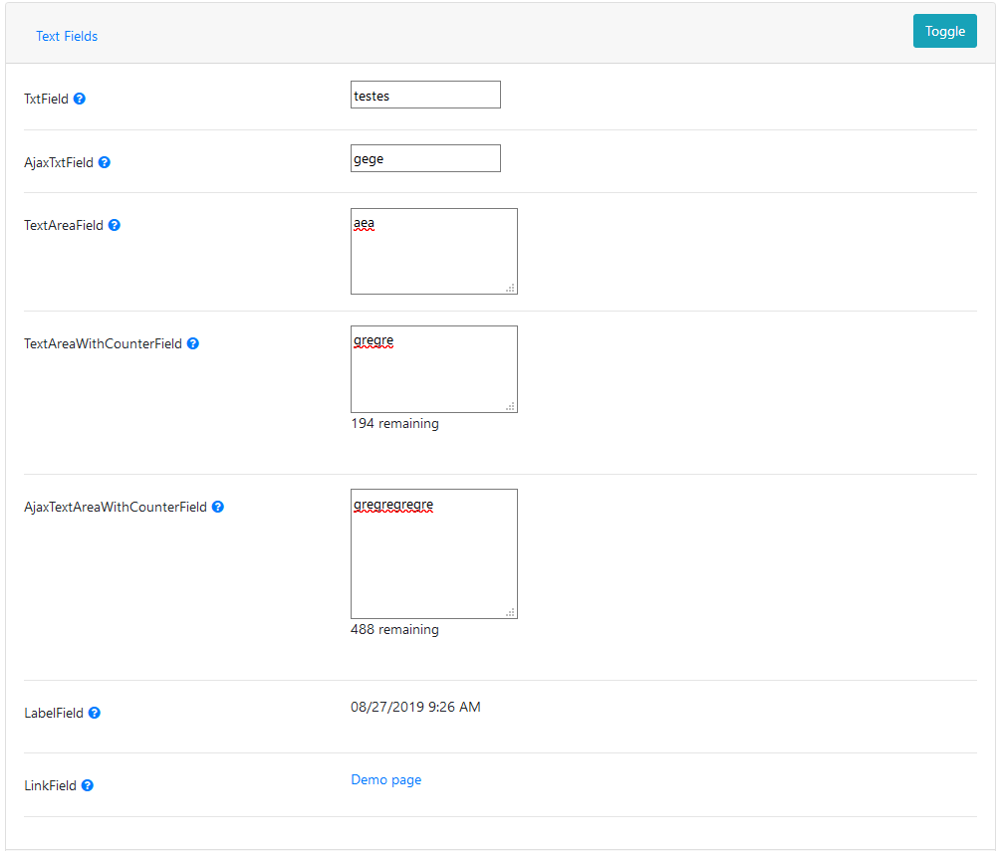
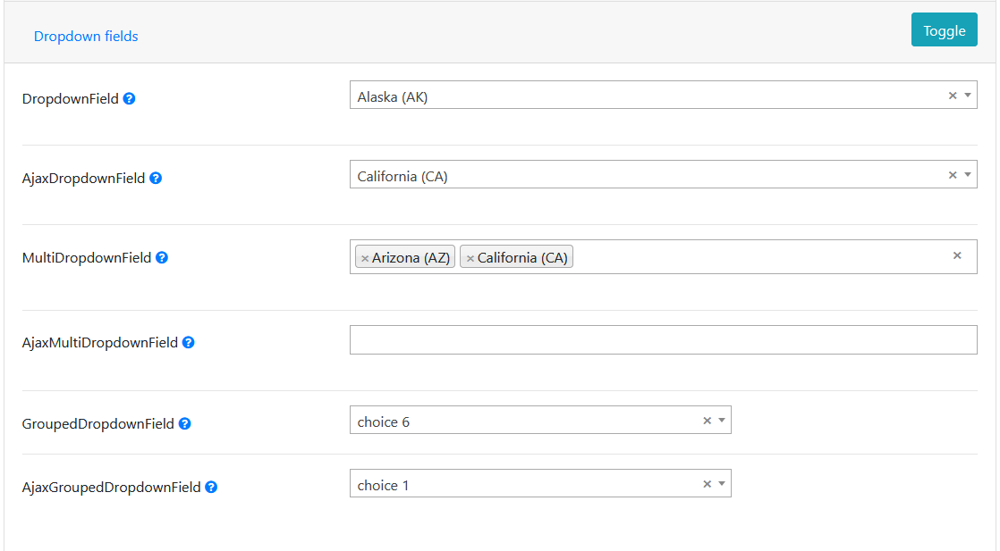
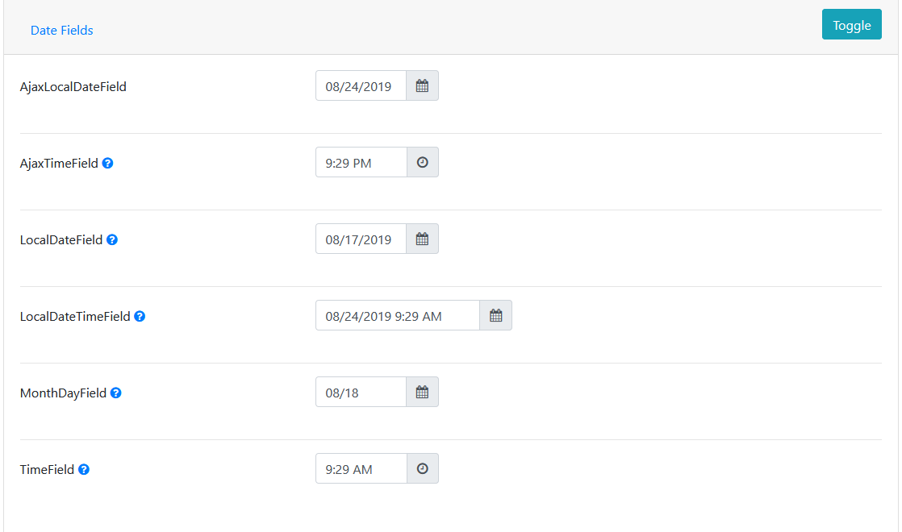
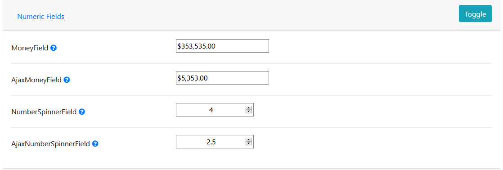
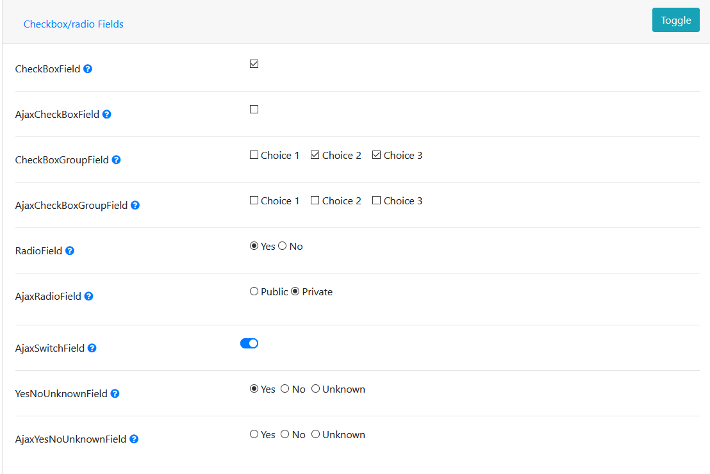

# wicket-fields - Wicket UI components

[Quick start](https://github.com/RomanSery/wicket-ui-fields#quick-start) | [Documentation](https://github.com/RomanSery/wicket-ui-fields/wiki) | [Demo webapp](https://github.com/RomanSery/wicket-ui-fields/tree/master/wicket-fields-demo) | [Screenshots](https://github.com/RomanSery/wicket-ui-fields#screenshots)

## Requirements

* Wicket 8+  
* Java 8+  
* Jquery

## Dependencies

* [Bootstrap 4](https://getbootstrap.com/)  
* [Wicket](https://wicket.apache.org/)  
* [Select2](https://select2.org/) - For dropdowns
* [Tempus Dominus](https://tempusdominus.github.io/bootstrap-4/) - For datetime pickers


## Key Features

* Includes various text, date, dropdown, multi-select, numeric, radio, and checkbox fields
* Simple, consistent syntax based on the Builder pattern is used to instantiate any type of field  
* No HTML required, just add a placeholder tag, and the HTML is created for you  
* All field are easily customizable using .properties files.  Supports multiple locals/environments.
* Easily toggle fields from read-write to read-only 
* Optimized for Wicket page sizes by minimizing number of components created
* Includes [full sample webapp demonstrating usage of each field](https://github.com/RomanSery/wicket-ui-fields/tree/master/wicket-fields-demo)


## Quick start

```java
// 1. In your WebApplication.init() method, initialize the WicketFieldsUI library
WicketFieldsUI.init(this);
```

```java
// 2. Add the UiFieldsBehavior to your WebPage which will add all the neccessary resources
add(new UiFieldsBehavior());
```

```java
// 3. Add the placeholder tag for your field in your .html file
<span wicket:id="userFirstName"></span>
```

```java
// 4. Add the field to your WebPage
add(new TxtField<String>(FieldArgs.Builder.of("userFirstName", "First Name", LambdaModel.of(user::getFirstName, formData::setFirstName)).build()));
```

```java
// 5. When you are done adding your fields, send the InitPanelFieldsEvent event to notify them to init themselves
send(this, Broadcast.BREADTH, new InitPanelFieldsEvent(null));
```

## Screenshots






